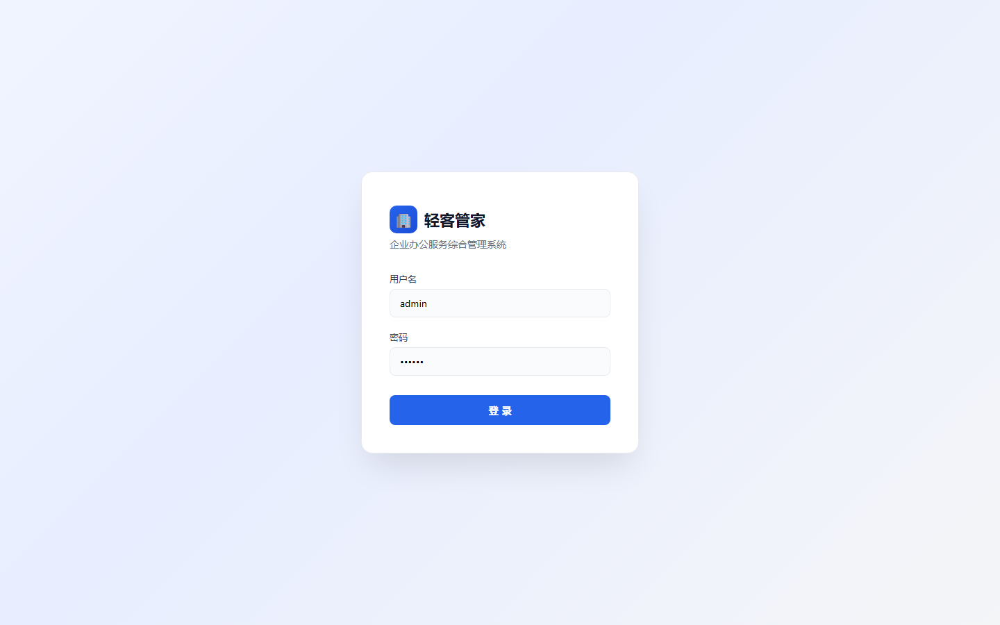
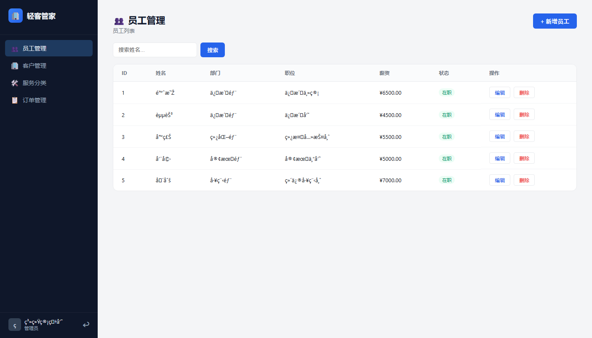
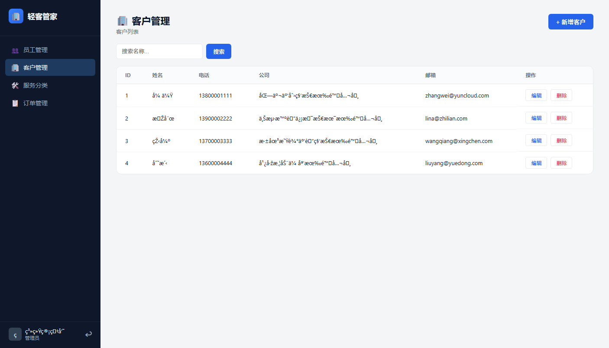
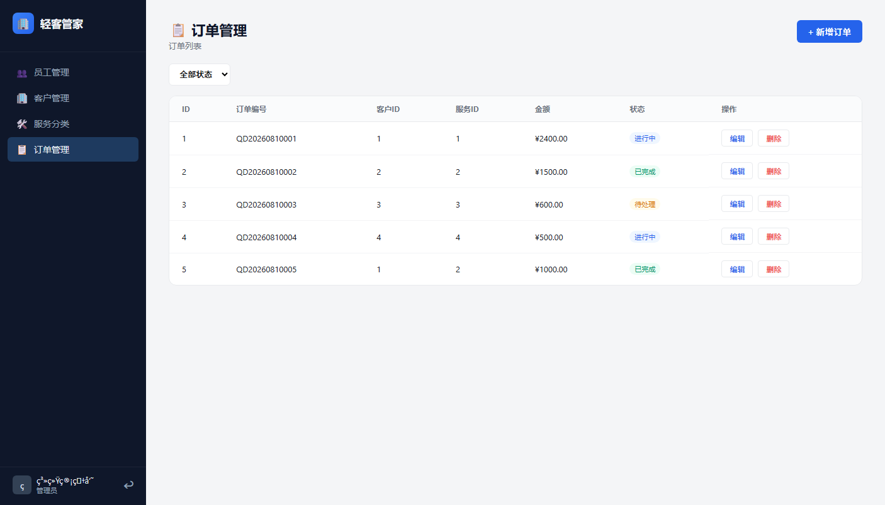
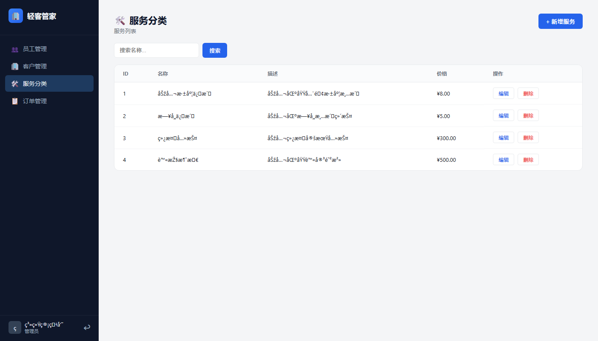

<div align="center">

# 🏢 轻客管家

**企业办公服务综合管理系统 · Enterprise Office Service Management System**

一款面向企业办公服务场景的前后端分离管理系统，覆盖**客户、员工、服务分类、订单流转与操作审计**等核心业务，实现从客户线索到服务订单的闭环管理，支持 Docker 一键部署。


</div>

---

## ✨ 功能特性

- 🔐 **认证与权限**：JWT 无状态登录认证 + BCrypt 密码加密，支持登录 / 注册 / 修改密码，角色权限（ADMIN / USER）
- 👥 **客户管理**：客户信息维护、关键词模糊搜索、分页查询
- 🧑‍💼 **员工管理**：员工档案、部门职位、薪资、入职日期管理
- 📋 **服务分类**：服务项目与基础价格管理
- 📦 **订单管理**：客户 + 服务 + 员工三表联动的订单流转，自动生成订单编号，多条件筛选
- 📄 **Excel 导出**：EasyExcel 流式导出订单数据，大数据量不担心内存溢出
- 🧾 **操作审计**：基于 Spring AOP + 自定义注解的操作日志，无侵入记录请求参数、返回结果与耗时
- 🗑️ **逻辑删除**：数据软删除可恢复，防止误删
- 📚 **API 文档**：SpringDoc 自动生成 Swagger 接口文档
- 🚀 **一键部署**：Docker 多阶段构建 + Compose 编排 + SQL 自动初始化

## 🖼️ 界面预览

| 登录页 | 员工管理 |
|:---:|:---:|
|  |  |

| 客户管理 | 订单管理 |
|:---:|:---:|
|  |  |

| 服务分类 |
|:---:|
|  |

## 🛠️ 技术栈

| 层 | 技术 |
|---|---|
| 后端 | Spring Boot 3.4.5 · Java 21 · MyBatis-Plus 3.5.9 |
| 数据库 | MySQL 8.0（H2 用于单元测试） |
| 认证 | JWT（jjwt 0.12.6）· BCrypt（spring-security-crypto） |
| 前端 | Vue 3 · Vite 8 · Pinia · Vue Router · Axios |
| 组件 | EasyExcel · Hutool · SpringDoc / Swagger · Lombok |
| 部署 | Docker · Docker Compose · Git |

## 🚀 快速开始

### 方式一：Docker 一键部署（推荐）

前置条件：安装 [Docker Desktop](https://www.docker.com/products/docker-desktop/)。

```bash
# 克隆项目
git clone https://github.com/LiYonah/qingkeManager.git
cd qingkeManager

# 一键启动（首次自动建表并创建 admin 账号）
docker compose up -d --build

# 访问系统
#   前端页面：  http://localhost:8080
#   Swagger：   http://localhost:8080/swagger-ui.html

# 查看日志 / 停止
docker compose logs -f app
docker compose down
```

> 🔑 **修改数据库密码（生产环境强烈建议）**：
> 在项目根目录创建 `.env` 文件：
> ```bash
> MYSQL_ROOT_PASSWORD=你的新密码
> ```
> 然后重新执行 `docker compose up -d --build`。

### 方式二：本地开发

前置条件：JDK 21、Maven 3.9+、Node.js 20+、MySQL 8.0。

```bash
# 1. 初始化数据库（新建 qingke_manager 库，utf8mb4）
mysql -uroot -p < sql/init.sql

# 2. 启动后端（端口 8080）
mvn spring-boot:run
#    数据库连接默认 127.0.0.1:3306/qingke_manager，可用环境变量覆盖（见下表）

# 3. 启动前端（端口 3000，/api 自动代理到后端）
cd qingke-web
npm install
npm run dev
```

## 👤 默认账号

| 账号 | 密码 | 角色 |
|---|---|---|
| admin | 123456 | ADMIN |

> ⚠️ 首次登录后请尽快在「修改密码」中更换默认密码。

## 📁 目录结构

```
qingkeManager/
├── src/                      # Spring Boot 后端源码
│   └── main/java/com/qingke/manager/
│       ├── controller/       # 接口层（登录、客户、员工、订单、服务分类）
│       ├── service/          # 业务层
│       ├── mapper/           # MyBatis-Plus Mapper
│       ├── entity/           # 实体（6 张表）
│       ├── config/           # JWT、拦截器、CORS、SPA 转发、MyBatis-Plus、OpenAPI
│       ├── aop/              # 操作日志切面
│       └── common/           # 统一返回 R、全局异常
├── qingke-web/               # Vue 3 前端源码
├── sql/init.sql              # 生产初始化脚本（建表 + 默认管理员）
├── docs/screenshots/         # 项目截图
├── Dockerfile                # 多阶段构建（前端 + 后端，JDK 21）
├── docker-compose.yml        # 一键部署编排
└── pom.xml                   # Maven 配置
```

## 🌐 环境变量说明

| 环境变量 | 默认值 | 说明 |
|---|---|---|
| `DB_HOST` | `127.0.0.1` | 数据库地址 |
| `DB_PORT` | `3306` | 数据库端口 |
| `DB_NAME` | `qingke_manager` | 数据库名 |
| `DB_USERNAME` | `root` | 数据库用户名 |
| `DB_PASSWORD` | `Lzx040305` | 数据库密码（生产务必覆盖） |
| `MYSQL_ROOT_PASSWORD` | `Lzx040305` | Docker 部署时 MySQL 密码（生产务必覆盖） |
| `MYSQL_DATABASE` | `qingke_manager` | Docker 部署时数据库名 |
| `MYSQL_PORT` | `3306` | Docker 部署时 MySQL 对外映射端口 |

## 📖 常见问题

**Q：刷新页面（如 /employees）报错或空白？**
已内置 SPA 路由转发过滤器，前端 history 路由直达 / 刷新均正常。

**Q：Docker 启动时 3306 端口被占用？**
本机已有 MySQL 占用 3306 时，使用其他端口：
```bash
MYSQL_PORT=3307 docker compose up -d --build
```

**Q：如何修改默认管理员密码？**
登录后点击右上角头像 →「修改密码」，输入新旧密码即可。

## 🤝 说明

- 本仓库为个人学习与演示项目，代码注释详细，适合作为前后端分离与 Spring Boot 实战参考。
- 单元测试：`mvn test`（基于 H2 内存库，不依赖真实 MySQL）。
- PPT 生成脚本：`create-ppt.js` / `create-summary-ppt.js`（`npm install` 后运行，用于生成项目总结 PPT）。